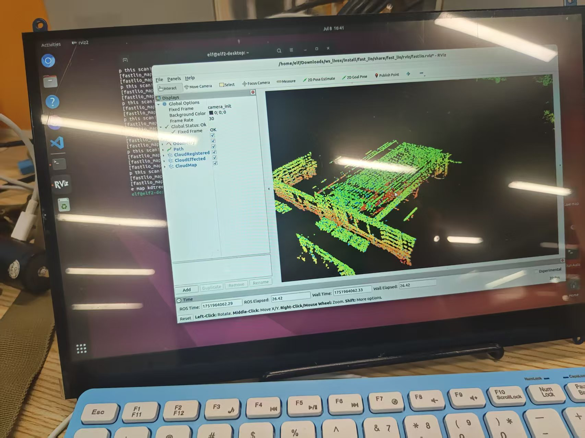
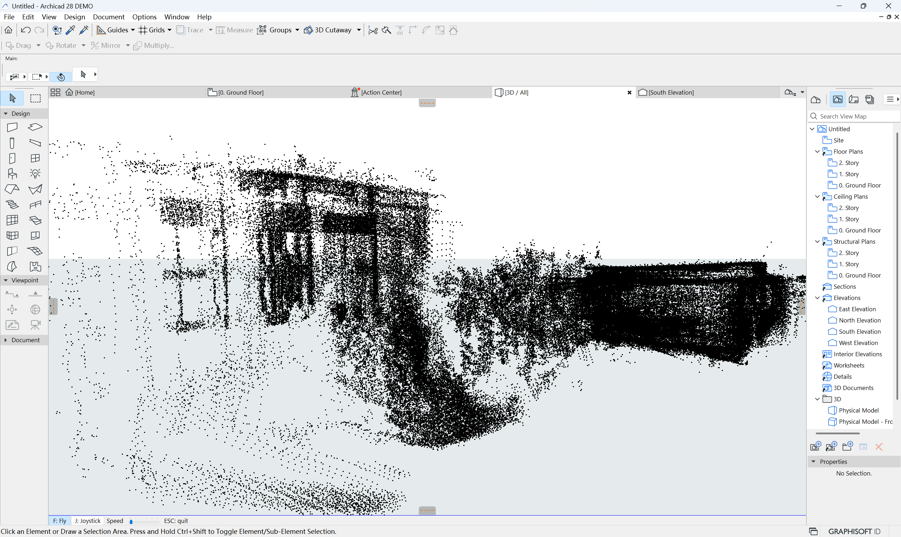

# 基于ELF2开发板的Livox双雷达分体式扫描系统
# 目录介绍
NormalSet：livox ros driver config文件以及fast lio config 文件  
shell ： 自启动脚本  
config： 代码外参  
launch： 启动脚本  

# 双Mid360激光雷达数据融合

本仓库主要存储双激光雷达节点融合功能包

## 概述

该功能包提供了一个ROS 2节点，具有以下功能：
- 订阅两个Livox Mid-360激光雷达传感器的数据
- 基于时间戳同步两个传感器的点云数据
- 应用坐标变换来融合点云数据
- 发布融合后的点云和同步的IMU数据

## 系统要求

- ROS 2 Humble
- Livox ROS Driver 2
- Livox SDK2  
- Fast Lio  
- PCL (点云库)
- Eigen3

## 编译
 mkdir build   
 cd build   
 cmake ..  
 make 

## 使用方法

1. 在`config/merge_config.yaml`中配置变换对应的外参参数，外参标定可以使用Livox Viewer  
2. 将Combine.cpp节点的IP地址更换为对应的IP地址  
3. 将NormalSet里面的config中有涉及到IP地址的更换为自己设备的IP  
4. 启动节点：

## 话题

### 订阅的话题
- `/livox/lidar_192_168_1_151` (livox_ros_driver2/msg/CustomMsg) - 第一个激光雷达传感器
- `/livox/lidar_192_168_1_3` (livox_ros_driver2/msg/CustomMsg) - 第二个激光雷达传感器
- `/livox/imu_192_168_1_151` (sensor_msgs/msg/Imu) - IMU数据

### 发布的话题
- `/merged_cloud` (livox_ros_driver2/msg/CustomMsg) - 融合后的点云
- `/cloud_registered_body/imu` (sensor_msgs/msg/Imu) - 变换后的IMU数据

###Fast LIO 建模示意图

### BIM系统运行示意图

